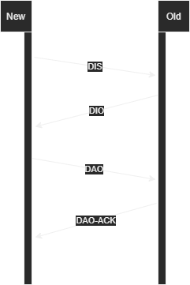

# Mensagens de Controle RPL

As mensagens de controle RPL são cruciais para a formação e manutenção da topologia da rede, permitindo que os nós se comuniquem de forma eficiente e estabeleçam rotas confiáveis. Neste material, exploraremos as principais mensagens de controle utilizadas no protocolo RPL e suas funções.

As mensagens de controle RPL têm como responsabilidades principais:

- **Formação do DODAG**: Estabelecer a estrutura hierárquica da rede.
- **Manutenção da Topologia**: Atualizar informações sobre a rede e ajustar as rotas conforme necessário.
- **Gerenciamento de Recursos**: Otimizar o uso de recursos da rede, como energia.

## Principais Mensagens de Controle:

- **DIS (DODAG Information Solicitation)**:
    - **Função**: Solicitar informações sobre o DODAG.
    - **Conteúdo**: ID do DODAG (opcional), entre outros.
    - **Objetivo**: Permitir que um nó recém-adicionado à rede descubra a topologia existente.

- **DIO (DODAG Information Object)**:
    - **Função**: Anunciar a existência de um nó e fornecer informações de roteamento.
    - **Conteúdo**: ID do DODAG, versão, Rank, métricas de roteamento, endereço IPv6 da raiz, entre outros.
    - **Objetivo**: Permitir que outros nós descubram o nó raiz e construam suas tabelas de roteamento.

- **DAO (Destination Advertisement Object)**:
    - **Função**: Propagar informações de rotas descendentes para permitir tráfego Ponto-a-Multiponto (P2MP).
    - **Conteúdo**: ID do DODAG, informações sobre os destinos, pais e sequência.
    - **Objetivo**: Permitir que os nós intermediários e a raiz conheçam os destinos disponíveis na rede.

- **DAO-ACK (Destination Advertisement Object Acknowledgment)**:
    - **Função**: Confirmar o recebimento de uma mensagem DAO.
    - **Conteúdo**: ID do DODAG, sequência, status, etc.
    - **Objetivo**: Garantir a entrega confiável das mensagens DAO.

A figura a seguir apresenta a troca de informação entre um novo nó e um nó antigo da rede.

## Processo de Formação do DODAG

1. **Início**: Um nó se autodenomina raiz e inicia a propagação de mensagens DIO.
2. **Propagação de DIO**: Os nós vizinhos recebem as mensagens DIO, calculam seus Ranks e as propagam para seus vizinhos.
3. **Criação do DODAG**: Os nós constroem suas tabelas de roteamento com base nas informações recebidas nas mensagens DIO.
4. **Envio de DAO**: Nós propagam informações sobre destinos disponíveis na rede em direção ao nó raiz.
5. **Estabilidade**: A rede alcança um estado estável quando a topologia se adapta às condições e não há mais mudanças significativas.

### Função Objetivo
A função objetivo (Objective Function) é um critério utilizado pelos nós para selecionar o melhor pai. Ela é definida com base em parâmetros como:
- **Métricas de Rota**: Número de saltos, custo da rota, etc.
- **Qualidade de Link**: Taxa de perda, latência, etc.
- **Restrições de Energia**: Priorizar rotas que consumam menos energia.

A OF desempenha um papel central na construção da topologia e na otimização do desempenho do DODAG.

**Referência**  
Tsvetkov, T. (2011). *RPL: IPv6 Routing Protocol for Low Power and Lossy Networks*. Technische Universität München. Disponível em: [https://doi.org/10.2313/NET-2011-07-1_09](https://doi.org/10.2313/NET-2011-07-1_09)
